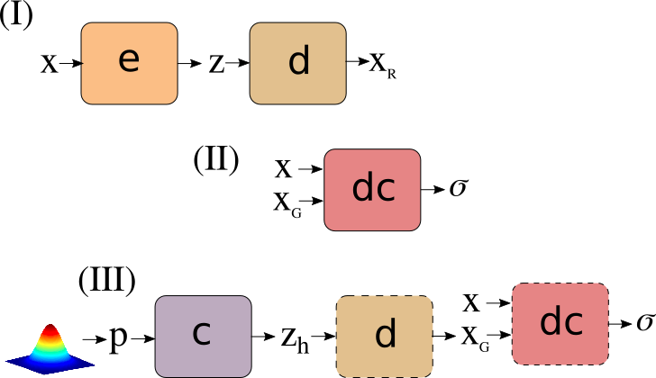

# AELP

Autoencoders with learnable priors.

## Main idea

Allow AE to learn its natural representation (z). Then try to map from prior distribution to distribution of z. This should increase "accuracy" of reconstruction meanwhile make this model generative. For example, AAE decrease quality of reconstruction due to updating encoders (e) weights.

## Algorithm

### Train AE reconstruction
This step is just the same as in vanilla AE (try to reconstruct x)

### Train discriminator
This step is just the same as vanilla GAN has, but dc learns to distinguish x (dataset or reconstruction) and xg (generated by c).

### Train "code generator" (c)
Update only c weights by dc loss (like generator weights in GAN)

## Problems and probable solutions
* Problem: "code generator" doesn't learn anything, probably because dc learns too fast. Try to reduce dc batch size or make it deeper (synchronize it with c)
